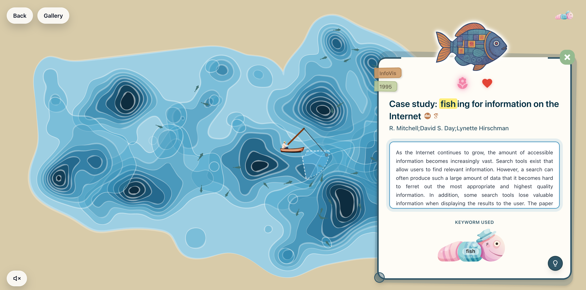

# Fishing for Papers

Fishing for Papers is a cozy, open-ended fishing game for serendipitous discovery of visualisation literature.

## Demo

- Online demo: <https://fishing-for-papers.github.io/game/>

[](https://drive.google.com/file/d/14HquVIsWnTfCNbGIohMh4zyaxSYemSmz/view?usp=sharing)

## Development

### Prerequisites

- Node.js 20+ recommended
- pnpm

### Install and Run

```bash
pnpm install
pnpm dev
```

## Environment Variables

Create a local `.env` file in `public-repos/game/` based on `.env.example`:

- `VITE_WORKER_URL`: public Cloudflare Worker endpoint
- `VITE_R2_PUBLIC_DOMAIN`: public R2 domain for generated assets

## Deployment

- GitHub Pages is deployed via GitHub Actions.
- Vite `base` is set to `/game/` for the project site path.
- Recommended branch workflow:
  - `dev`: active development
  - `main`: stable release/deployment
  - merge via pull request (`dev -> main`)

## Citation

If you use this project in research or teaching, please cite:

```bibtex
@inproceedings{eschner2026fishing,
  title     = {Fishing for Papers: A Serendipitous Knowledge Discovery Game},
  author    = {Eschner, Johannes and Guo, Yuhan},
  booktitle = {EuroVis Workshop on Visualization Play, Games, and Activities (VisGames)},
  year      = {2026},
  month     = jun,
}
```
